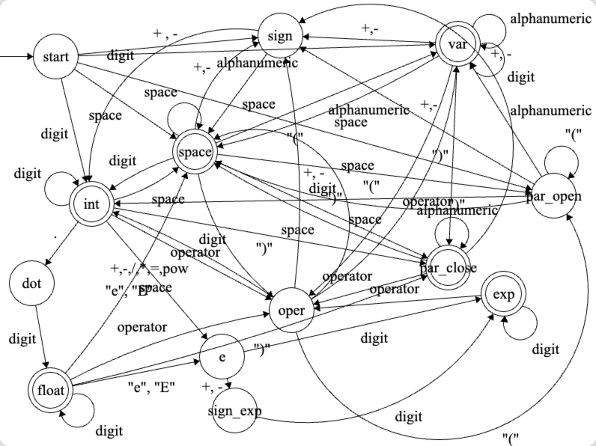

### Francisco Urquizo Schnaas
### 26/04/24

# Actividad 3.2 Programando un DFA
Una de las aplicaciones de los autómatas finitos determinísticos es la implementación de reconocedores de tokens en un lenguaje de programación (conocido como Lexer en los compiladores).

En esta actividad deberás hacer un programa que reciba como entrada un archivo con una serie de expresiones aritméticas, escritas bajo ciertas reglas, y entregará como salida el conjunto de tokens reconocidos, indicando su tipo, o indicando que hay un error en su formación, es decir, no se respetaron las reglas establecidas.

## Manual de usuario:
Esta actividad fue desarrollada en el lenguaje de programación funcional, Elixir. Para poder utilizarlo para analizar diferentes expresiones aritméticas con relación a los tokens de los que están compuestas, es importante tener Elixir instalado en la máquina en la que se esté implementando el código.

Para correr el código, se debe abrir una terminal nueva en el directorio en el que esté localizado el archivo con extensión .exs y utilizar el comando "elixir Act3.2.exs", donde Act3.2.exs es el nombre del archivo en cuestión.

Para probar diferentes expresiones aritméticas, uno debe localizar la última línea de código en el archivo que tiene el siguiente comentario: # Llamada a la función arithmetic_lexer.
Habiéndola localizado, se debe poner como argumento de la función la expresión que se desée evaluar. A continuación un ejemplo de una llamada a la función arithmetic_lexer:

```elixir
IO.inspect(TokenList.arithmetic_lexer("res   = (  38.24 - one ) * 5 - (2.3e-5/toy)"))
```

Si la expresión pasada como argumento es válida, se obtendrá un resultado indicando los tokens que ésta contiene, en el orden en el que aparecen, junto con los caracteres que forman parte de cada uno, en una lista de tuplas. Esto se ejemplifica a continuación:

```elixir
[
  var: "res",
  oper: "=",
  par_open: "(",
  float: "38.24",
  oper: "-",
  var: "one",
  par_close: ")",
  oper: "*",
  int: "5",
  oper: "-",
  par_open: "(",
  exp: "2.3e-5",
  oper: "/",
  var: "toy",
  par_close: ")"
]
```

En el caso de que la expresión no sea válida acorde a las reglas encapsuladas en la función de transición, delta_arithmetic, se regresará el valor booleano "false":

```elixir
false
```

## Autómata - Diagrama de estados:



## Tabla de transición:
| Estado/Entrada | " " | sign | digit | alpha | "(" | ")" | "e", "E" | operator | "." | otro |
|----------------|-----|------|-------|-------|-----|-----|----------|----------|-----|------|
| **start**      | start | sign | int | var | par_open | fail | fail | fail | fail | fail |
| **int**        | int_space | fail | int | fail | fail | par_close | e | oper | dot | fail |
| **e**          | fail | sign_exp | exp | fail | fail | fail | fail | fail | fail | fail |
| **sign_exp**   | fail | fail | exp | fail | fail | fail | fail | fail | fail | fail |
| **exp**        | fail | fail | exp | fail | fail | fail | fail | oper | fail | fail |
| **dot**        | float_space | fail | float | fail | fail | par_close | e | oper | fail | fail |
| **float**      | float_space | fail | float | fail | fail | par_close | e | oper | fail | fail |
| **oper**       | operator_space | sign | int | var | par_open | fail | fail | fail | fail | fail |
| **var**        | var_space | sign | var | var | fail | par_close | fail | oper | fail | fail |
| **par_open**   | par_open_space | sign | int | var | par_open | fail | fail | fail | fail | fail |
| **par_close**  | par_close_space | sign | fail | fail | fail | par_close | fail | oper | fail | fail |
| **int_space**  | int_space | sign | fail | fail | fail | fail | fail | oper | fail | fail |
| **var_space**  | var_space | sign | fail | fail | fail | par_close | fail | oper | fail | fail |
| **float_space**| float_space | sign | fail | fail | fail | fail | fail | oper | fail | fail |
| **operator_space**| operator_space | sign | int | var | par_open | fail | fail | fail | fail | fail |
| **sign**       | sign_space | fail | int | fail | fail | fail | fail | fail | fail | fail |
| **fail**       | fail | fail | fail | fail | fail | fail | fail | fail | fail | fail |
| **sign_space** | sign_space | fail | int | fail | fail | fail | fail | fail | fail | fail |
| **par_open_space**| par_open_space | sign | int | var | fail | fail | fail | fail | fail | fail |
| **par_close_space**| par_close_space | sign | fail | fail | fail | par_close | fail | oper | fail | fail |
